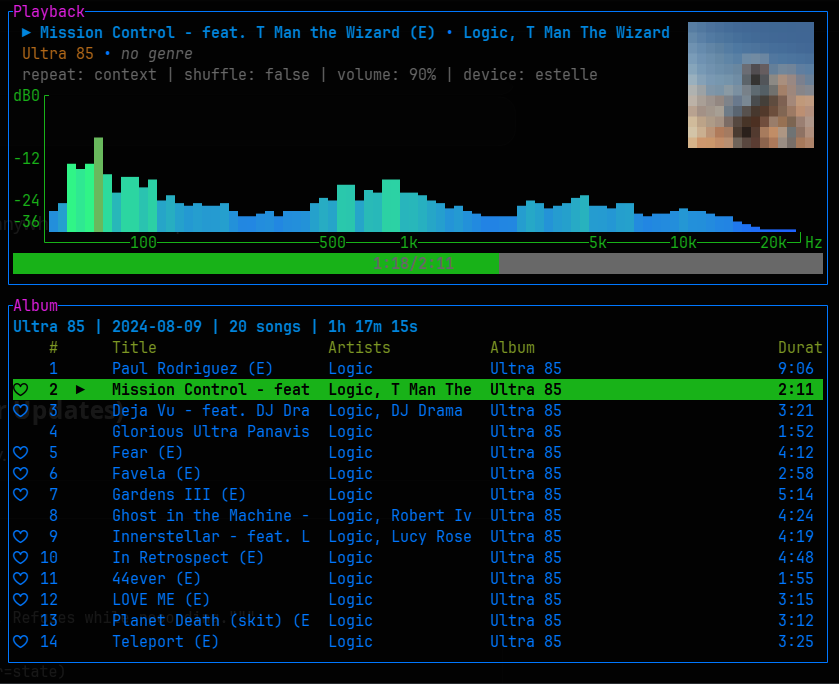

# spotify_player

## Table of Contents

- [Introduction](#introduction)
- [Examples](#examples)
- [Installation](#installation)
- [Authentication](#authentication)
  - [How authentication works](#how-authentication-works)
  - [Why you may be asked to authenticate twice](#why-you-may-be-asked-to-authenticate-twice)
  - [Client ID and rate limits](#client-id-and-rate-limits)
  - [Using a custom client ID](#using-a-custom-client-id)
- [Features](#features)
  - [Spotify Connect](#spotify-connect)
  - [Streaming](#streaming)
  - [Audio Visualization](#audio-visualization)
  - [Media Control](#media-control)
  - [Image](#image)
  - [Notify](#notify)
  - [Toasts](#toasts)
  - [Mouse support](#mouse-support)
  - [Daemon](#daemon)
  - [Fuzzy search](#fuzzy-search)
  - [CLI commands](#cli-commands)
- [Commands](#commands)
- [Configurations](#configurations)
- [Caches](#caches)
  - [Logging](#logging)
- [Acknowledgement](#acknowledgement)

## Introduction

`spotify_player` is a fast, easy to use, and configurable terminal music player.

**Features**

- Minimalist UI with an intuitive paging and popup system.
- Highly [configurable](https://github.com/aome510/spotify-player/blob/master/docs/config.md)
- Feature parity with the official Spotify application.
- Support remote control with [Spotify Connect](#spotify-connect).
- Support [streaming](#streaming) songs directly from the terminal.
- Support [audio visualization](#audio-visualization).
- Support synced lyrics.
- Support [cross-platform media control](#media-control).
- Support [image rendering](#image).
- Support [desktop notification](#notify).
- Support running the application as [a daemon](#daemon)
- Offer a wide range of [CLI commands](#cli-commands)

## Examples

A demo of `spotify_player` `v0.5.0-pre-release` on [youtube](https://www.youtube.com/watch/Jbfe9GLNWbA) or on [asciicast](https://asciinema.org/a/446913):

Checkout [examples/README.md](https://github.com/aome510/spotify-player/blob/master/examples/README.md) for more examples.

## Installation

By default, the application's installed binary is `spotify_player`.

### Requirements

A Spotify Premium account is **required**.

#### Dependencies

##### Windows and MacOS

- [Rust and cargo](https://www.rust-lang.org/tools/install) as the build dependencies

##### Linux

- [Rust and cargo](https://www.rust-lang.org/tools/install) as the build dependencies
- install `openssl`, `alsa-lib` (`streaming` feature), `libdbus` (`media-control` feature), `libpulse` (`system-audio-visualization` feature, enabled by default in this fork).
  - For example, on Debian based systems, run the below command to install application's dependencies:

    ```shell
    sudo apt install libssl-dev libasound2-dev libdbus-1-dev libpulse-dev
    ```

  - On RHEL/Fedora based systems, run the below command to install application's dependencies :

    ```shell
    sudo dnf install openssl-devel alsa-lib-devel dbus-devel pulseaudio-libs-devel
    ```

    or if you're using `yum`:

    ```shell
    sudo yum install openssl-devel alsa-lib-devel dbus-devel pulseaudio-libs-devel
    ```

### Binaries

Application's prebuilt binaries can be found in the [Releases Page](https://github.com/aome510/spotify-player/releases).

**Note**: to run the application, Linux systems need to install additional dependencies as specified in the [Dependencies section](#linux).

### Homebrew

Run `brew install spotify_player` to install the application.

### Scoop

Run `scoop install spotify-player` to install the application.

### Cargo

Install via Cargo:

```
cargo install spotify_player --locked
```

### Arch Linux

Install via Arch Linux:

```
pacman -S spotify-player
```

**Note**: Defaults to PulseAudio/Pipewire. For a different backend, modify the [official PKGBUILD](https://gitlab.archlinux.org/archlinux/packaging/packages/spotify-player) and rebuild manually. See [Audio Backends](#audio-backend).

### Void Linux

Install via Void Linux:

```
xbps-install -S spotify-player
```

### FreeBSD

Install via FreeBSD:

```
pkg install spotify-player
```

### NetBSD

Install via NetBSD:

```
pkgin install spotify-player
```

Build from source on NetBSD:

```
cd /usr/pkgsrc/audio/spotify-player
make install
```

### NixOS

[spotify-player](https://search.nixos.org/packages?channel=unstable&show=spotify-player&from=0&size=50&sort=relevance&type=packages&query=spotify-player) is available as a Nix package. Install via:

```
nix-shell -p spotify-player
```

To build from source locally, run `nix-shell` in the root of the source checkout. The provided `shell.nix` will install prerequisites.

### Docker

**Note**: The streaming feature is disabled in the Docker image.

Download the latest Docker image:

```
docker pull aome510/spotify_player:latest
```

Run the Docker container:

```
docker run --rm -it aome510/spotify_player:latest
```

To use your local config and cache folders:

```
docker run --rm \
-v $APP_CONFIG_FOLDER:/app/config/ \
-v $APP_CACHE_FOLDER:/app/cache/ \
-it aome510/spotify_player:latest
```

## Authentication

`spotify_player` requires a **Spotify Premium** account and authenticates against the Spotify Web API using the [OAuth 2.0 authorization code flow with PKCE](https://developer.spotify.com/documentation/web-api/tutorials/code-pkce-flow). No client secret is stored or required.

The simplest way to authenticate is to just **run the application** — on first use it prompts for whichever credentials are not yet cached. Each prompt opens the Spotify authorization page in your browser; after you approve access, Spotify redirects to a local loopback address (`login_redirect_uri`, default `http://127.0.0.1:8989/login`) where `spotify_player` captures the authorization code and exchanges it for an access token. Credentials are cached in the application's [cache folder](#caches), so this is a one-time step per machine.

Alternatively, run the `spotify_player authenticate` CLI command to authenticate **both** credentials up front — useful for setting things up ahead of a [daemon](#daemon) or headless launch. Unlike a normal launch, `authenticate` always forces a fresh interactive login for both credentials, ignoring any cached tokens, so it can also be used to re-authenticate from scratch.

### How authentication works

Two distinct credentials are involved:

- A **Web API token**, used for all REST calls (playback control, library, search, playlists, etc.). This is obtained through the OAuth flow above.
- A **librespot session**, used for the [streaming](#streaming) feature (direct playback and Spotify Connect device registration).

Both authenticate through your Spotify account; the only thing that differs is the _client ID_ presented to Spotify (see below).

### Why you may be asked to authenticate twice

With the [streaming](#streaming) feature enabled (the default), the first launch can open the Spotify authorization page **twice** — once for each credential described above, in this order:

1. The **Web API token**, presented under the configured `client_id` (ncspot's by default). This is cached as `user_client_token.json`.
2. The **librespot session** credentials, presented under Spotify's official client ID. These are cached as `credentials.json`.

These are two independent OAuth flows with two different client IDs, so Spotify requires a separate approval for each, and each token is cached separately in the [cache folder](#caches). This is a one-time step per machine — once both tokens are cached, subsequent launches reuse and silently refresh them, and you will not be prompted again unless the cache is cleared or a token is revoked.

The `spotify_player authenticate` command runs both flows in one go (forcing a fresh login for each). If the `streaming` feature is disabled, the librespot session is not needed, so you are prompted just once (step 1).

### Client ID and rate limits

Every request to the Spotify Web API is attributed to a Spotify _application_, identified by a **client ID**. The client ID — not your account — determines the [API quota](https://developer.spotify.com/documentation/web-api/concepts/rate-limits) you are subject to.

By default, `spotify_player` uses [ncspot](https://github.com/hrkfdn/ncspot)'s client ID. This is intentional: that client ID is registered in [extended quota mode](https://developer.spotify.com/documentation/web-api/concepts/quota-modes) and predates Spotify's [November 2024 Web API changes](https://developer.spotify.com/blog/2024-11-27-changes-to-the-web-api). As a result it has a much higher rate limit and access to endpoints (browse, personalized content, generated playlists, …) that newly-registered applications can no longer use.

> [!IMPORTANT]
> **You almost certainly should not configure your own `client_id`.** Any application you register today starts in Spotify's restricted _default_ quota mode. Using such a client ID commonly leads to `429 Too Many Requests` and `403 Forbidden` errors and missing browse/personalized data. This was the root cause of several reported issues (e.g. [#890](https://github.com/aome510/spotify-player/issues/890), [#893](https://github.com/aome510/spotify-player/issues/893), [#912](https://github.com/aome510/spotify-player/issues/912), [#913](https://github.com/aome510/spotify-player/issues/913)), and switching to the bundled default client ID ([#918](https://github.com/aome510/spotify-player/pull/918)) resolved them.
>
> The recommended setup is to **leave `client_id` unset** so the bundled default is used.

### Using a custom client ID

A custom client ID is only worthwhile if you have a specific reason — for example an application that has been granted extended quota mode by Spotify, or organizational policy requiring your own registered app.

If you do need one, [register an application](https://developer.spotify.com/dashboard) on the Spotify developer dashboard, add your `login_redirect_uri` (default `http://127.0.0.1:8989/login`) to the app's allowed redirect URIs, then set `client_id` (or `client_id_command`) in `app.toml`. See the [Client id command](https://github.com/aome510/spotify-player/blob/master/docs/config.md#client-id-command) section of the configuration docs for details.

After changing the client ID, re-run `spotify_player authenticate` to refresh the cached token.

## Features

### Spotify Connect

Control Spotify remotely with [Spotify Connect](https://support.spotify.com/us/article/spotify-connect/). Press **D** to list devices, then **enter** to connect.

On Linux, when `enable_streaming = "Never"` and you control the official desktop client via `preferred_device`, that app is often missing from Connect until local playback starts — or already running idle/paused in the system tray after autostart. Enable `[desktop_spotify]` in `app.toml` so **first session** (and **playing reconnect**) visibly report, launch when needed, optionally hide to the system tray, and MPRIS-nudge Spotify whenever the preferred device is absent or not actively playing (even if another speaker such as Amazon Everywhere is listed; active audio on another speaker is left alone when preferred is already listed), then transfer to the woken client once Connect lists it. A later session reconnect while playback is paused does not OpenUri-nudge the idle tray client (that was starting music after API blips); reconnect still wakes when restoring a playing session. If the desktop client is already Playing via MPRIS, wake/OpenUri/Pause is skipped so existing audio keeps playing — init waits up to 15s for `preferred_device` to appear in Connect and transfers with keep-playing when it does; if Connect still omits it, playback is left unchanged until you start something (Enter/play), which then registers the desktop client (OpenUri on the current track without pausing audible playback) and retries transfer on transient API errors. If Connect lists `preferred_device`, first-session init still transfers to that device with keep-playing and never to another speaker. If Connect still has no current playback, the TUI playback window uses MPRIS metadata (track, artists, album, progress, cover URL) until Connect lists a session. Connect often reports 0% volume for that client; the TUI uses MPRIS volume instead so the playback row does not start at 0%. By default the registration Play is silenced via Pulse/PipeWire sink-input mute and mute is held until pause confirms, including retries and a short background hold (`pause_after_nudge = true`); unmute after pause or a timeout so mute cannot stick forever. Starting the desktop app does not begin audible playback; use `spotify_player playback play` or the TUI play command when you want audio. Or run `spotify_player wake-desktop`. See [docs/config.md](./docs/config.md#desktop-spotify-wake-linux).

### Streaming

Stream music directly from the terminal. The streaming feature is enabled by default and uses the `rodio-backend` audio backend unless otherwise specified.

The app uses [librespot](https://github.com/librespot-org/librespot) to create an integrated Spotify client, registering a `spotify-player` device accessible via Spotify Connect.

#### Audio backend

Default audio backend is [rodio](https://github.com/RustAudio/rodio). Available backends:

- `alsa-backend`
- `pulseaudio-backend`
- `rodio-backend`
- `portaudio-backend`
- `jackaudio-backend`
- `rodiojack-backend`
- `sdl-backend`
- `gstreamer-backend`

To use a different audio backend, specify the `--features` option when building. For example:

```shell
cargo install spotify_player --no-default-features --features pulseaudio-backend
```

**Notes**:

- Use `--no-default-features` to disable the default `rodio-backend`.
- Additional dependencies may be required for some backends. See [Librespot documentation](https://github.com/librespot-org/librespot/wiki/Compiling#general-dependencies).

To disable streaming, build with:

```shell
cargo install spotify_player --no-default-features
```

### Audio Visualization

Real-time audio visualization is displayed in the playback window as a frequency-band bar chart (128 log-scale bands from bass (left) to treble (right)) with dB and Hz axis labels, a themed grid, the progress bar directly below the chart, and repeat/shuffle/volume/device spread across a full-width row under the bar while music is streamed locally via the integrated [librespot](https://github.com/librespot-org/librespot) player.

With the `system-audio-visualization` feature (enabled by default in this fork on Linux), set `enable_system_audio_visualization` to `true` to also drive the bars from the PipeWire/Pulse default-sink monitor when playback is on an external Spotify Connect device (for example desktop Spotify playing local/lossless files). While a track is loaded, the visualization area stays reserved (including pause, where bars idle at zero); it is hidden only when there is no current track.

Set `enable_audio_visualization` to `true` in your config to enable this feature. See [config docs](./docs/config.md).

With the `image` feature also enabled, the cover sits in the top-right of the playback window and may overlap the visualizer's top-right corner. Track/album/genre text stays on the left, indented one column left of the chart's vertical axis; repeat/shuffle/volume/device stay on a full-width row under the progress bar.



### Media Control

Media control is enabled by default. Set `enable_media_control` to `true` in your config to use it. See [config docs](https://github.com/aome510/spotify-player/blob/master/docs/config.md#media-control).

Media control uses [MPRIS DBus](https://wiki.archlinux.org/title/MPRIS) on Linux and OS window events on Windows and macOS.

### Image

Image rendering (album covers in the playback window) is enabled by default via the `image` feature. To build without it:

```shell
cargo install spotify_player --no-default-features --features rodio-backend,media-control,system-audio-visualization
```

Image rendering is powered by [`ratatui-image`](https://github.com/benjajaja/ratatui-image), which auto-detects the terminal's graphics protocol (Kitty, iTerm2, Sixel) on startup. Terminals without any graphics protocol support fall back to [block characters](https://en.wikipedia.org/wiki/Block_Elements).

**Notes**:

- Protocol detection queries the terminal via stdio. In nested terminals (e.g. Neovim's floating terminal), the query does not reach the outer terminal emulator, so the protocol falls back to block characters.
- With audio visualization enabled, the cover is placed top-right (may overlap the chart's top-right); metadata is indented one column left of the chart's vertical axis.

Image rendering examples:

- iTerm2:


- Kitty:


- Sixel (`foot` terminal):


- Others:


#### Pixelate

For a pixelated look, enable the `pixelate` feature (also enables `image`):

```shell
cargo install spotify_player --features pixelate
```

Adjust the pixelation with the `cover_img_pixels` config option.

| `cover_img_pixels` | `8`                                                                                                                 | `16`                                                                                                                  | `32`                                                                                                                  | `64`                                                                                                                  |
| ------------------ | ------------------------------------------------------------------------------------------------------------------- | --------------------------------------------------------------------------------------------------------------------- | --------------------------------------------------------------------------------------------------------------------- | --------------------------------------------------------------------------------------------------------------------- |
| example            |  |  |  |  |

To temporarily disable pixelation, set `cover_img_pixels` to a high value (e.g., `512`).

### Notify

To enable desktop notifications, build with the `notify` feature (disabled by default):

```shell
cargo install spotify_player --features notify
```

**Note**: Notification support is limited on macOS and Windows compared to Linux.

### Toasts

The TUI shows a short overlay in the lower-right of the main content area (never on the playback window) after likes, queue adds, playlist edits, skip next/previous, copy-link, and opening a Spotify link from the clipboard. Each box grows with the message up to about 60 columns and 6 rows (four inner lines); overflow beyond that is clipped with `…`. Up to three toasts are stacked; a `4+` marker denotes additional queued messages. Body text is not bold so wrapped lines stay inside the border. Toasts, including errors, disappear after `toast_success_timeout_secs` (default 3). `esc` still dismisses the current toast early when no popup is open. Set `enable_toast = false` to disable. Desktop `notify` for track changes is separate.

### Mouse support

Mouse support: You can seek to a position in the playback by left-clicking the progress bar.

### Daemon

To enable daemon mode, build with the `daemon` feature (disabled by default):

```shell
cargo install spotify_player --features daemon
```

Run as a daemon with `-d` or `--daemon`: `spotify_player -d`.

**Notes**:

- Daemon mode is not supported on Windows.
- Daemon mode requires streaming and an audio backend.
- On macOS, daemon mode does not work with media control (enabled by default). To use daemon mode on macOS, disable media control:

  ```shell
  cargo install spotify_player --no-default-features --features daemon,rodio-backend
  ```

### Fuzzy search

To enable [fuzzy search](https://en.wikipedia.org/wiki/Approximate_string_matching), build with the `fzf` feature (disabled by default).

### CLI Commands

`spotify_player` provides several CLI commands for interacting with Spotify:

- `get`: Get Spotify data (playlist/album/artist data, user's data, etc)

  `spotify_player get key <key>` returns JSON for the selected key:

  | Key | Data |
  |---|---|
  | `playback` | Current playback |
  | `devices` | Available Connect devices |
  | `user-playlists` | Current user's playlists |
  | `user-liked-tracks` | Liked tracks |
  | `user-saved-albums` | Saved albums |
  | `user-followed-artists` | Followed artists |
  | `user-top-tracks` | Personal top tracks over ~6 months (`medium_term`) |
  | `user-top-tracks-short-term` | Personal top tracks over ~4 weeks (`short_term`) |
  | `user-top-tracks-long-term` | Personal top tracks over ~1 year (`long_term`) |
  | `queue` | Current playback queue |

- `playback`: Interact with the playback (start a playback, play-pause, next, etc)
- `search`: Search spotify
- `connect`: Connect to a Spotify device
- `wake-desktop`: Launch/nudge the official Spotify desktop app so Connect can see it (Linux; requires `[desktop_spotify] enable = true`)
- `like`: Like currently playing track
- `authenticate`: Authenticate the application
- `playlist`: Playlist editing (new, delete, import, fork, etc)

For more details, run `spotify_player -h` or `spotify_player {command} -h`.

**Notes**

- On first use, run `spotify_player authenticate` to authenticate the app.
- CLI commands communicate with a client socket on port `client_port` (default: `8080`). If no instance is running, a new client is started, which may increase latency.

#### Scripting

The command-line interface is script-friendly. Use the `search` subcommand to retrieve Spotify data in JSON format, which can be processed with tools like [jq](https://jqlang.github.io/jq/).

Example: Start playback for the first track from a search query:

```sh
read -p "Search spotify: " query
spotify_player playback start track --id $(spotify_player search "$query" | jq '.tracks.[0].id' | xargs)
```

## Commands

Press `?` or `C-h` to open the shortcut help page (default for `OpenCommandHelp`).

**Tips**:

- Use the `Search` command to search in the shortcut help page and other pages.
- `RefreshPlayback` manually updates playback status.
- `RestartIntegratedClient` is useful for switching audio devices without restarting the app.

List of supported commands:

| Command                         | Description                                                                                        | Default shortcuts  |
| ------------------------------- | -------------------------------------------------------------------------------------------------- | ------------------ |
| `NextTrack`                     | next track                                                                                         | `n`                |
| `PreviousTrack`                 | previous track                                                                                     | `p`                |
| `ResumePause`                   | resume/pause based on the current playback                                                         | `space`            |
| `PlayRandom`                    | play a random track in the current context                                                         | `.`                |
| `Repeat`                        | cycle the repeat mode (context → track → off)                                                      | `r`, `R`           |
| `Shuffle`                       | toggle the shuffle mode                                                                            | `s`, `C-s`         |
| `VolumeChange`                  | change playback volume by an offset (default shortcuts use 5%)                                     | `+`, `-`           |
| `Mute`                          | toggle playback volume between 0% and previous level                                               | `_`                |
| `SeekStart`                     | seek start of current track                                                                        | `^`                |
| `SeekForward`                   | seek forward by a duration in seconds (defaults to `seek_duration_secs`)                           | `>`                |
| `SeekBackward`                  | seek backward by a duration in seconds (defaults to `seek_duration_secs`)                          | `<`                |
| `Quit`                          | quit the application                                                                               | `C-c`, `q`         |
| `ClosePopup`                    | close a popup, or dismiss the current toast if none is open                                        | `esc`              |
| `SelectNextOrScrollDown`        | select the next item in a list/table or scroll down (supports vim-style count: 5j)                 | `j`, `C-n`, `down` |
| `SelectPreviousOrScrollUp`      | select the previous item in a list/table or scroll up (supports vim-style count: 10k)              | `k`, `C-p`, `up`   |
| `PageSelectNextOrScrollDown`    | select the next page item in a list/table or scroll a page down (supports vim-style count: 3C-f)   | `page_down`, `C-f` |
| `PageSelectPreviousOrScrollUp`  | select the previous page item in a list/table or scroll a page up (supports vim-style count: 2C-b) | `page_up`, `C-b`   |
| `SelectFirstOrScrollToTop`      | select the first item in a list/table or scroll to the top                                         | `g g`, `home`      |
| `SelectLastOrScrollToBottom`    | select the last item in a list/table or scroll to the bottom                                       | `G`, `end`         |
| `ChooseSelected`                | choose the selected item                                                                           | `enter`            |
| `RefreshPlayback`               | manually refresh the current playback                                                              | `C-r`              |
| `RestartIntegratedClient`       | restart the integrated client (`streaming` feature only)                                           | `g R`              |
| `ShowActionsOnSelectedItem`     | open a popup showing actions on a selected item                                                    | `g a`, `C-space`   |
| `ShowActionsOnCurrentTrack`     | open a popup showing actions on the current track                                                  | `a`                |
| `ShowActionsOnCurrentContext`   | open a popup showing actions on the current context                                                | `A`                |
| `AddSelectedItemToQueue`        | add the selected item to queue                                                                     | `Z`, `C-z`         |
| `FocusNextWindow`               | focus the next focusable window (if any)                                                           | `tab`              |
| `FocusPreviousWindow`           | focus the previous focusable window (if any)                                                       | `backtab`          |
| `SwitchTheme`                   | open a popup for switching theme                                                                   | `T`                |
| `SwitchDevice`                  | open a popup for switching device                                                                  | `D`                |
| `Search`                        | open a popup for searching in the current page                                                     | `/`                |
| `BrowseUserPlaylists`           | open a popup for browsing user's playlists                                                         | `u p`              |
| `BrowseUserFollowedArtists`     | open a popup for browsing user's followed artists                                                  | `u a`              |
| `BrowseUserSavedAlbums`         | open a popup for browsing user's saved albums                                                      | `u A`              |
| `CurrentlyPlayingContextPage`   | go to the currently playing context page                                                           | `g space`          |
| `TopTrackPage`                  | go to the user top track page (~6 months)                                                          | `g t`              |
| `ShortTermTopTrackPage`         | go to the user top track page (~4 weeks)                                                           | `g S`              |
| `LongTermTopTrackPage`          | go to the user top track page (~1 year)                                                            | `g Y`              |
| `RecentlyPlayedTrackPage`       | go to the user recently played track page                                                          | `g r`              |
| `LikedTrackPage`                | go to the user liked track page                                                                    | `g y`, `l`         |
| `LyricsPage`                    | go to the lyrics page of the current track                                                         | `g L`              |
| `LibraryPage`                   | go to the user library page                                                                        | `g l`              |
| `SearchPage`                    | go to the search page                                                                              | `g s`              |
| `BrowsePage`                    | go to the browse page                                                                              | `g b`              |
| `Queue`                         | go to the queue page                                                                               | `z`                |
| `OpenCommandHelp`               | go to the command help page                                                                        | `?`, `C-h`         |
| `PreviousPage`                  | go to the previous page                                                                            | `backspace`, `C-q` |
| `OpenLogs`                      | go the the application logs page                                                                   | `g o`              |
| `OpenSpotifyLinkFromClipboard`  | open a Spotify link from clipboard                                                                 | `O`                |
| `SortTrackByTitle`              | sort the track table (if any) by track's title                                                     | `o t`              |
| `SortTrackByArtists`            | sort the track table (if any) by track's artists                                                   | `o a`              |
| `SortTrackByAlbum`              | sort the track table (if any) by track's album                                                     | `o A`              |
| `SortTrackByAddedDate`          | sort the track table (if any) by track's added date                                                | `o D`              |
| `SortTrackByDuration`           | sort the track table (if any) by track's duration                                                  | `o d`              |
| `SortLibraryAlphabetically`     | sort the library alphabetically                                                                    | `o l a`            |
| `SortLibraryByRecent`           | sort the library (playlists and albums) by recently added items                                    | `o l r`            |
| `ReverseOrder`                  | reverse the order of the track table (if any)                                                      | `o r`              |
| `MovePlaylistItemUp`            | move playlist item up one position                                                                 | `C-k`              |
| `MovePlaylistItemDown`          | move playlist item down one position                                                               | `C-j`              |
| `CreatePlaylist`                | create a new playlist                                                                              | `N`                |
| `JumpToCurrentTrackInContext`   | jump to the current track in the context                                                           | `g c`              |
| `JumpToHighlightTrackInContext` | jump to the currently highlighted search result in the context                                     | `C-g`              |

To add or modify shortcuts, see the [keymaps section](https://github.com/aome510/spotify-player/blob/master/docs/config.md#keymaps).

### Actions

Not all actions are available for every Spotify item. To see available actions, use `ShowActionsOnCurrentTrack` or `ShowActionsOnSelectedItem`, then press enter to trigger the action. Some actions may not appear in the popup but can be bound to shortcuts.

List of available actions:

- `GoToArtist`
- `GoToAlbum`
- `GoToRadio`
- `AddToLibrary`
- `AddToPlaylist`
- `AddToQueue`
- `AddToLiked`
- `DeleteFromLiked`
- `DeleteFromLibrary`
- `DeleteFromPlaylist`
- `ShowActionsOnAlbum`
- `ShowActionsOnArtist`
- `ShowActionsOnShow`
- `ToggleLiked` (default shortcuts: `L` on the selected item, `C-l` on the currently playing track)
- `CopyLink`
- `Follow`
- `Unfollow`

Actions can also be bound to shortcuts. To add new shortcuts, see the [actions section](https://github.com/aome510/spotify-player/blob/master/docs/config.md#actions).

### Search Page

When entering the search page, focus is on the search input. Enter text, use `backspace` to delete, and `enter` to search.

To move focus from the search input to other windows (track results, album results, etc.), use `FocusNextWindow` or `FocusPreviousWindow`.

## Configurations

By default, configuration files are located in `$HOME/.config/spotify-player`. Change this with `-c <FOLDER_PATH>` or `--config-folder <FOLDER_PATH>`.

If no configuration file is found, one will be created with default values.

See [configuration documentation](https://github.com/aome510/spotify-player/blob/master/docs/config.md) for details on available options.

## Caches

By default, cache files are stored in `$HOME/.cache/spotify-player` (logs, credentials, audio cache, etc.). Change this with `-C <FOLDER_PATH>` or `--cache-folder <FOLDER_PATH>`.

### Logging

Logs are stored in `$APP_CACHE_FOLDER/spotify-player-*.log`. For debugging or issues, check the backtrace file in `$APP_CACHE_FOLDER/spotify-player-*.backtrace`.

Set the `RUST_LOG` environment variable to control [logging level](https://docs.rs/log/0.4.14/log/enum.Level.html). Default is `spotify_player=INFO`.

## Acknowledgement

`spotify_player` is written in [Rust](https://www.rust-lang.org) and built on top of libraries like [ratatui](https://github.com/ratatui/ratatui), [rspotify](https://github.com/ramsayleung/rspotify), [librespot](https://github.com/librespot-org/librespot), and more. It is inspired by [spotify-tui](https://github.com/Rigellute/spotify-tui) and [ncspot](https://github.com/hrkfdn/ncspot).
