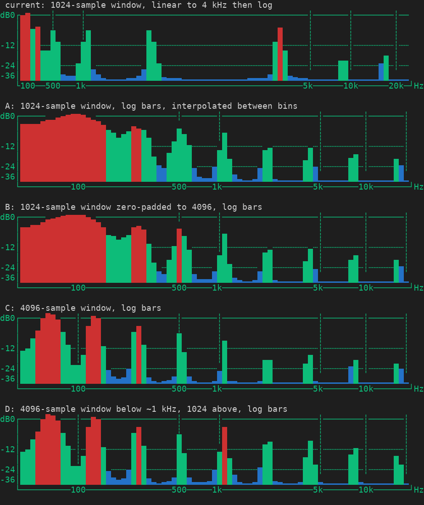
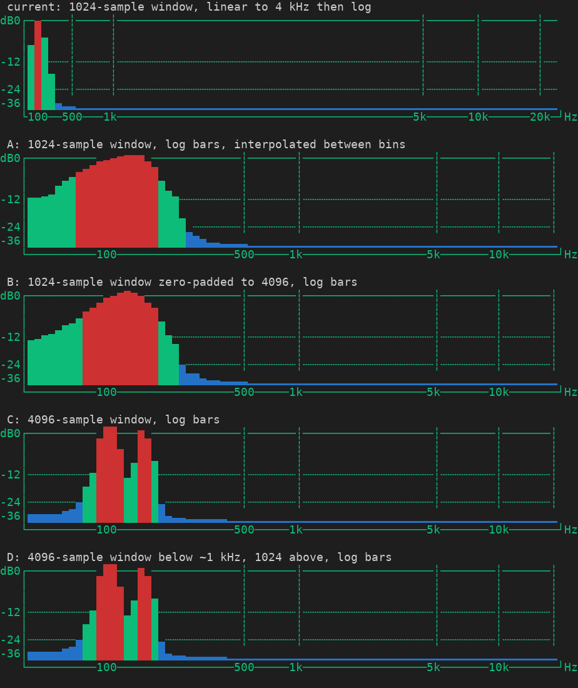
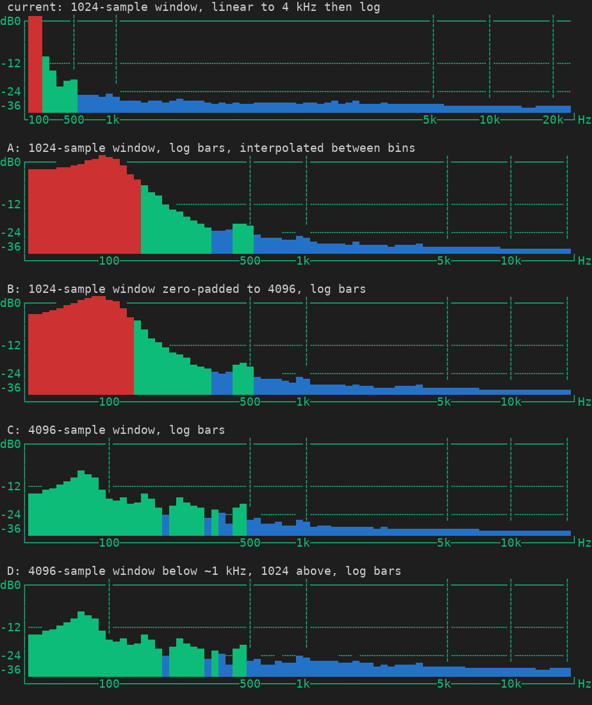

# Prototype — which analysis gives the visualizer a logarithmic frequency axis that still looks right?

**Critical unknown:** the bars are linear up to about 4 kHz because a 1024-sample window has only 23 bins below 1 kHz. A log axis needs the low end from somewhere: interpolation between those bins, a longer window, or both. Source reading cannot say what each looks like or costs.

**Scenario / real boundary:** the production pipeline on this branch (Hann window, `rustfft`, band mapping, three-point smoothing, per-hop decay, peak envelope) and the production renderer, `render_audio_visualization`, drawing into ratatui's `TestBackend`. Input is synthetic mono PCM at 48 kHz, the rate of the system-audio capture, in hops of 128 samples. No audio device, no Spotify. Deviations: synthetic signals instead of music; decay advanced by exactly one hop per hop instead of wall-clock time so runs are repeatable.

**Variants,** all sharing one band mapping defined in Hz (128 bars log-spaced from 40 Hz to 20 kHz, each bar the RMS of the interpolated power spectrum between its edges):

| | Window | FFT | Idea |
| --- | --- | --- | --- |
| current | 1024 | 1024 | control: today's layout, one bin per bar up to 4 kHz |
| A | 1024 | 1024 | log bars, interpolated between bins |
| B | 1024 | 4096 | the same window zero-padded: finer interpolation, no new information |
| C | 4096 | 4096 | a window four times longer |
| D | 4096 below ~1 kHz, 1024 above | both | long window for the bass, short one for the rest, cross-faded from 600 Hz to 1.2 kHz |

**What physics already says:** a 1024-sample window lasts 21 ms and cannot separate two tones closer than roughly two bins, 94 Hz, however the spectrum is interpolated. A and B can only make the low end look smooth. Only a longer window resolves it, and a longer window reacts later.

**Budget / stop:** one implementation wave, one measurement batch, stop when every variant has numbers and frames.

**Measurement oracle:** per variant, on identical signals: where steady tones peak against where the axis puts them; depth of the valley between two simultaneous tones, taken at the worst hop of the steady part; bars within 6 dB of the peak for one tone; time for a tone's bar to reach half its steady value after onset and to fall to a tenth after it stops, both before display decay; level of 1.2 to 2 kHz against 350 to 600 Hz on pink noise; microseconds per hop in a release build, as the best and the median of 15 interleaved rounds. Added after the first results, as a measurement with no criterion attached: how high an equal-amplitude tone at 1, 4 and 10 kHz reads against one at 100 Hz.

**Acceptance oracle,** bound before the measurement run:

1. Placement: 100, 440, 1000, 5000 and 10000 Hz each peak within one bar of their axis position.
2. Bass resolution: 100 Hz and 150 Hz together show a valley of at least 6 dB at the worst hop.
3. Responsiveness: onset to half within 15 ms at 1 kHz, as today, and within 60 ms at 60 Hz.
4. Cost: at most ten times the current cost per hop and at most 2 % of one core.
5. Level continuity, dual window only: the pink-noise tilt stays within 3 dB of the single-window variants.

**Valid while / revalidate when:** hop size 128, the smoothing and decay constants and the renderer stay as on `main` at `f5f5d39`. Revalidate with real music and at 44.1 kHz, where every bin is 9 % narrower.

## Harness self-test

All five configurations: a 1 kHz tone peaks within one bar of its axis position (known pass); silence gives all-zero bars; a lone 100 Hz tone is reported as not resolved by the two-tone oracle (known fail).

Two oracles were repaired after their first use. The thresholds were not touched either time.

- **Valley.** The first run sampled the valley on the last frame only and showed B separating 100 and 150 Hz by 8.5 dB, which contradicts the physics above: two unresolved tones beat, so one frame can show a valley that is gone milliseconds later. The oracle now takes the worst hop.
- **Cost.** One timing pass per variant gave 39 µs per hop for C in one run and 71 µs in the next. The host has four fast and four slow cores and scales its clock. The oracle now takes the best and the median of 15 interleaved rounds, and two further runs were pinned to one fast and one slow core.

Every measurement other than cost is identical, to the last digit, in all five release runs.

## Results

Release build, 48 kHz, 375 hops per second. Raw numbers: [`metrics-release.json`](assets/visualizer-log-axis/metrics-release.json), and the pinned runs in [`metrics-release-fast-core.json`](assets/visualizer-log-axis/metrics-release-fast-core.json) and [`metrics-release-slow-core.json`](assets/visualizer-log-axis/metrics-release-slow-core.json).

| | current | A | B | C | D |
| --- | --- | --- | --- | --- | --- |
| 100 Hz, 1 kHz, 10 kHz ticks at | 1 %, 16 %, 86 % | 15 %, 52 %, 89 % | same as A | same as A | same as A |
| Worst placement error, bars | 0.57 | **1.37** at 100 Hz | 0.37 | 0.37 | 0.37 |
| Valley, 100 + 150 Hz, dB | 0.0 | **0.1** | **0.3** | 12.9 | 12.9 |
| Valley, 110 + 220 Hz, dB | 0.3 | 0.7 | 2.0 | 41.5 | 41.5 |
| Valley, 60 + 80 Hz, dB | 0.0 | 0.0 | 0.0 | 0.2 | 0.2 |
| Bars lit by one 100 Hz tone | 3 | 23 | 21 | 7 | 7 |
| Onset to half, 60 Hz / 1 kHz / 5 kHz, ms | 10.7 / 10.7 / 10.7 | 10.7 / 10.7 / 8.0 | as A | 42.7 / **34.7** / 34.7 | 42.7 / 10.7 / 8.0 |
| Release to a tenth, 60 Hz / 1 kHz / 5 kHz, ms | 16 / 19 / 19 | 16 / 19 / 19 | as A | 64 / 69 / 72 | 64 / 45 / 19 |
| Pink tilt, dB | −5.8 | −5.8 | −5.8 | −5.5 | **+0.5** |
| Cost per hop, µs, best / median | 3.1 / 4.5 | 7.7 / 11.0 | 26.4 / 36.8 | 27.1 / 39.0 | 21.6 / 31.2 |
| Times today's cost | 1 | 2.5 | 8.6 | 8.8 | 7.0 |
| Share of one core, best / median | 0.12 % / 0.17 % | 0.29 % / 0.41 % | 0.99 % / 1.38 % | 1.02 % / 1.46 % | 0.81 % / 1.17 % |
| Criteria met | 1, 3, 4 | 3, 4 | 1, 3, 4* | 1, 2, 4* | 1, 2, 3, 4* |
| Not bound: equal tone at 1 / 4 / 10 kHz against 100 Hz, dB | −0.3 / −0.3 / −12.0 | −2.7 / −9.1 / −14.0 | −2.7 / −9.3 / −14.2 | −8.3 / −14.8 / −18.9 | −2.8 / −7.9 / −12.8 |

Bold marks the value that fails a criterion.

\* Criterion 4 is met in this run, and the ratio to today's cost stays between 6.5 and 8.8 in all three runs that repeat the rounds. The 2 % part has little margin: pinned to a single core, the median for B, C and D rose to between 2.1 % and 3.0 % of that core, while the best rounds stayed between 0.7 % and 1.2 %. The cause was not investigated; clock scaling is the likely one.

Frames, every variant drawn by the real renderer at 84 columns, the width of the playback pane:

The music-like frame is taken 20 ms after a kick. The short windows already show it at full height; the long window is still rising, which is criterion 3 seen in a picture. A 150-column version is in [`assets/visualizer-log-axis/music-like-150.png`](assets/visualizer-log-axis/music-like-150.png).

## Conclusion

- **A and B are negative.** They give the log axis, but a single bass note lights 21 to 23 bars and notes an octave apart at 110 and 220 Hz stay merged. A also draws a 100 Hz tone more than a bar off, because the peak snaps to a 47 Hz grid. B costs as much as C and resolves nothing more than A.
- **C is positive for layout and resolution, negative on one bound.** Octave-spaced tones become nine evenly spaced peaks and 100 + 150 Hz separate by 13 dB. It reacts 24 to 32 ms later than today at every frequency, about one screen refresh at the default 32 ms. The slower release is hidden by the display's own decay, which takes 0.4 s to fall to a tenth. The slower attack belongs to the window and cannot be tuned away. A hit shorter than the window is also spread across it, so short percussive sounds should read lower than today; that was not measured.
- **D is positive on everything bound except level continuity.** It has C's bass and today's speed above 1 kHz. With gains matched for tones, noise-like content reads about 6 dB lower below the crossover than above it, because a longer window spreads noise over narrower bins.
- **Levels need their own decision, for every log variant.** Today's rule was kept unchanged: a bar is the RMS of the bins under it, then bars are smoothed over three neighbours. Today that is harmless up to 4 kHz because a bar is one bin. Once bars are wider than a bin, a note reads lower the wider its bar: at 4 kHz an equal note reads 9 dB below a 100 Hz one in A and B, 8 dB in D and 15 dB in C, against 0.3 dB today. Noise-like content between 2 and 8 kHz reads 4.6 dB lower in C than in A. D's level step is the same mechanism. A rule that sums power per bar, or takes the strongest bin, should remove most of this; that was not measured.
- **Nothing resolves 60 + 80 Hz.** That needs a window of 8192 samples or more.
- **Cost does not separate the candidates.** B, C and D all cost 7 to 9 times today's analysis, about 1 to 3 % of one core depending on its clock speed. The running app averaged 6.6 % of a core on this host over 37 minutes, so the increase is visible in a process list and small in absolute terms. The long transform does not have to run on every hop; running it every fourth would cut the cost to roughly a quarter, which was not measured.

Remaining unknowns: the level rule; how C's slower attack and D's seam look against real music; behaviour at 44.1 kHz.

Seen on the way: with the axis ending exactly at 20 kHz the `20k` label no longer fits and is dropped; a log axis wants a tick set of its own, since nothing is labelled between 40 and 100 Hz; a log axis defined in Hz makes the ticks independent of the sample rate, which they are not today.

## Disposition

Prototype code stays on branch `proto/visualizer-log-axis` and is not meant for `main`: the selectable `Analysis` in `spotify_player/src/vis.rs`, the axis carried in `VisBands`, and the harness in `spotify_player/src/ui/vis_proto_harness.rs`. With `SPOTIFY_PLAYER_VIS_PROTO` unset a build of this branch runs today's layout; set to `A`, `B`, `C` or `D` it runs that variant, which allows a live look with real music. That switch has not been exercised in a running app. Frames are regenerated with `render_png.py` in the assets folder from the harness's JSON dumps.

Next: a human choice. The evidence supports dropping A and B. Between the other two, D is the stronger direction: C's failure comes with its window, D's comes from a level rule that can be changed. Neither should be built as prototyped, because the level rule affects both. A second round on that rule, with the same harness and criteria bound in advance, and a live look with real music would close the remaining unknowns. Whatever is chosen then goes through normal development with tests; nothing here is promoted as it stands.

**Review pending.**
